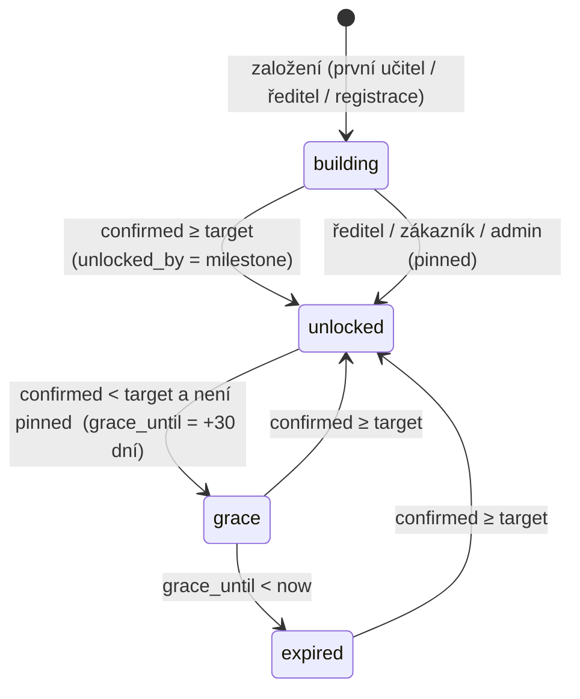

# Datový model DVPP zdarma

Migrace: [`supabase/migrations/20260905100000_dvpp_lead_magnet_core.sql`](../../supabase/migrations/20260905100000_dvpp_lead_magnet_core.sql).
Postgres projektu `Vividbooks_Web+eshop` (`iekkundgizzdbmkzatdl`). Obsah záznamů zůstává v KV (`vividbooks_dvpp_videos_v2`, `vividbooks_webinars_v1`), řady v KV `vividbooks_dvpp_series_v1`.

## ER diagram

```mermaid
erDiagram
  schools ||--o{ subscribers : "school_red_izo"
  schools ||--o| staffrooms : "red_izo"
  staffrooms ||--o{ staffroom_members : "red_izo"
  subscribers ||--o| staffroom_members : "subscriber_id (1 škola na kontakt)"
  subscribers ||--o{ referrals : "inviter_id"
  staffrooms ||--o{ referrals : "red_izo"
  subscribers ||--o{ certificates : "subscriber_id"
  subscribers ||--o{ dvpp_progress : "subscriber_id"
  subscribers ||--o{ dvpp_sessions : "subscriber_id"
  subscribers ||--o{ content_votes : "subscriber_id"
  content_topics ||--o{ content_votes : "topic_id"
  subscribers ||--o{ funnel_events : "subscriber_id (volitelně)"
  subscribers }o--o| subscribers : "referred_by"

  schools {
    text red_izo PK "9 číslic; náhradní 9+IČO"
    text ico "8 číslic"
    text name
    text type
    bool is_primary "ZŠ = cílová skupina"
    int pupils_count
    int teachers_count "fyzické osoby / odhad"
    bool teachers_estimated
    text domain "školní e-mail, lower"
    text status "customer|staffroom|active|trace|blank|lost"
    text status_reason
    text director_name
    text email
    timestamptz first_contact_at
    timestamptz milestone_reached_at
  }

  subscribers {
    uuid id PK
    text email UK
    text status "subscribed|pending|unsubscribed|cleaned"
    enum source "+ dvpp"
    text position_label
    text school_red_izo FK
    text teacher_type "badatel|trener|vypravec|architekt"
    uuid referred_by FK
    jsonb dvpp_profile "kvíz, progressive profiling"
    timestamptz dvpp_first_login_at
    timestamptz dvpp_last_login_at
  }

  dvpp_sessions {
    uuid id PK
    uuid subscriber_id FK
    text token_hash UK "sha256(token)"
    timestamptz expires_at "180 dní"
    timestamptz last_seen_at
    timestamptz revoked_at
  }

  staffrooms {
    text red_izo PK_FK
    text code UK "6 znaků, /s/{code}"
    uuid founder_id FK
    int milestone_target "4|8|12|16"
    int confirmed_count
    text status "building|unlocked|grace|expired"
    text unlocked_by "milestone|director|customer|manual"
    timestamptz unlocked_at
    timestamptz grace_until "+30 dní"
  }

  staffroom_members {
    text red_izo PK_FK
    uuid subscriber_id PK_FK
    text via "founder|link|code|director|domain|registration|referral|manual"
    uuid invited_by FK
    timestamptz joined_at
    timestamptz activated_at "≥3 min přehrání / certifikát"
  }

  referrals {
    uuid id PK
    uuid inviter_id FK
    text red_izo FK
    text invitee_email "maže se po 14 dnech"
    text invitee_email_hash "sha256, zůstává"
    text token UK
    text status "sent|confirmed|expired|bounced"
    uuid confirmed_subscriber_id FK
    text review_flag "alias|burst|same_ip|disposable"
  }

  certificates {
    uuid id PK
    uuid subscriber_id FK
    text number UK "VB-DVPP-{rok}-{6}"
    text kind "dvpp|feedback|series|champion"
    text webinar_id
    text video_id
    text series_id
    text title
    numeric hours
    text lecturer
    text holder_name
    timestamptz issued_at
    text pdf_url
  }

  dvpp_progress {
    uuid subscriber_id PK_FK
    text video_id PK
    int position_seconds
    int duration_seconds
    bool completed
    timestamptz updated_at
  }

  content_topics {
    text id PK "slug"
    text title
    text status "open|scheduled|done|archived"
    int votes_count
    text scheduled_webinar_id
  }

  content_votes {
    uuid subscriber_id PK_FK
    text topic_id PK_FK
  }

  funnel_events {
    bigserial id PK
    text event
    uuid subscriber_id FK
    text email_hash "sha256(lower(email))"
    text red_izo
    text source "utm"
    text medium "utm"
    text campaign "utm"
    text content "utm"
    uuid referrer_id
    text session_key "vb_id"
    jsonb meta
    timestamptz created_at
  }
```

## Stavové automaty

### Sborovna (`staffrooms.status`)



Přepočet: `recountStaffroom()` v `dvpp/milestones.ts`, spouští `recountOne()` po každém potvrzení/aktivaci a cron `/cron/dvpp-recount` denně.

### Škola (`schools.status`)

| Stav | Pravidlo (`schoolStatusFrom`) | Komunikace |
|---|---|---|
| `customer` | aspoň jeden kontakt školy `is_customer` | sborovna zdarma automaticky |
| `staffroom` | sborovna `unlocked` nebo `grace` | udržet, výkaz řediteli |
| `active` | ≥ 3 aktivní kontakty | e-maily zakladateli, letáček |
| `trace` | 1–2 aktivní kontakty | „pozvěte kolegu“ |
| `blank` | 0 kontaktů, nikdy žádný | ředitel: e-mail, dopis |
| `lost` | 0 aktivních, dřív někdo byl | za 6 měsíců jiné téma |

### Přístup do knihovny (`resolveAccessLevel`)

| Úroveň | Kdo | Co vidí |
|---|---|---|
| `guest` | nepřihlášený | upoutávky, prvních ~10 minut, katalog se zámky |
| `starter` | přihlášený bez sborovny | 3 záznamy (počítá se `dvpp_progress`), certifikáty k nim |
| `full` | sborovna `unlocked`/`grace`, přivedl ≥ 1 aktivovaného kolegu, zákazník, `dvpp_profile.personal_access_until` v budoucnu | všechno |

## Milník podle velikosti sboru

| `schools.teachers_count` | `milestone_target` |
|---|---|
| neznámý | 8 |
| ≤ 10 | 4 |
| 11–25 | 8 |
| 26–50 | 12 |
| 51+ | 16 |

Když výkaz chybí, `teachers_count` = `max(3, round(pupils_count / 12))` a `teachers_estimated = true`. Admin může hodnotu opravit (`PUT /admin/dvpp/schools/:redIzo`).

## Události funnelu (`funnel_events.event`)

| Událost | Kdy | Meta CAPI |
|---|---|---|
| `visit` | landing / upoutávka (z prohlížeče přes `/dvpp/events`) | – |
| `lead` | e-mail zadán (magic link, registrace k záznamu) | `Lead` |
| `confirmed` | klik v přihlašovacím e-mailu (první přihlášení nebo s intentem) | `CompleteRegistration` |
| `profile_done` | kvíz „Jaký jste učitel“ | `Subscribe` |
| `school_linked` | kontakt dostal RED_IZO (IČO / doména / profil) | – |
| `webinar_registered` | registrace na živý webinář | `Schedule` |
| `play` | první přehrání záznamu | `ViewContent` |
| `certificate` | osvědčení vystaveno | `Certificate` |
| `staffroom_created` | první učitel založil sborovnu | – |
| `invite_shared` | klik na sdílení odkazu/kódu (kanál v meta) | `InviteShared` |
| `invite_sent` | vzkaz kolegovi odeslán | `InviteSent` |
| `invite_confirmed` | kolega se přihlásil přes kód/odkaz | `InviteAccepted` |
| `staffroom_unlocked` | milník splněn | `SchoolMilestone` |
| `staffroom_grace` | pokles pod milník | – |
| `director_unlock` | ředitel odemkl školu | – |
| `vote` | hlas pro téma | – |

## Klíče v KV, které projekt používá

| Klíč | Obsah |
|---|---|
| `vividbooks_dvpp_videos_v2` | katalog záznamů (Webflow sync + minulé webináře) |
| `vividbooks_webinars_v1` | webináře (admin) |
| `vividbooks_dvpp_series_v1` | řady `{ series: [{ id, title, description, subjects, videoIds, hours, cover, order }] }` |
| `dvpp_login_intent_{email}` | dočasně: `next`, `newsletter`, `name`, UTM, `staffroomCode` (maže se po přihlášení) |
| `webinar_survey_{webinarId}_{md5(email)}` | dokončený DVPP dotazník (existující) — podmínka pro vystavení osvědčení |
