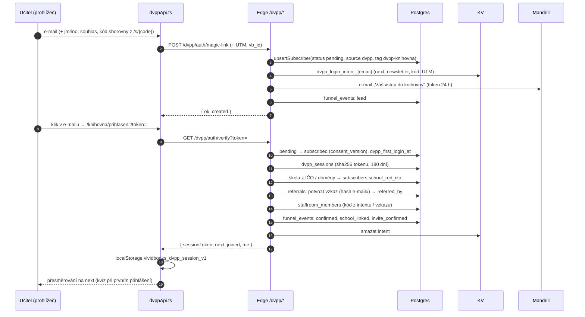
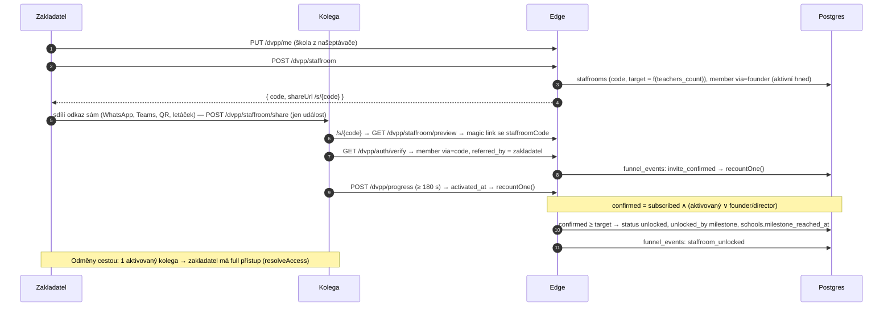
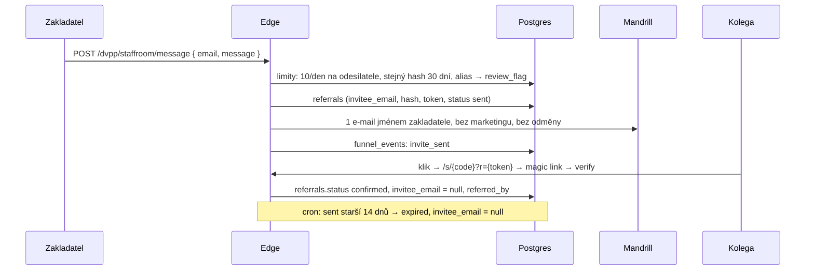
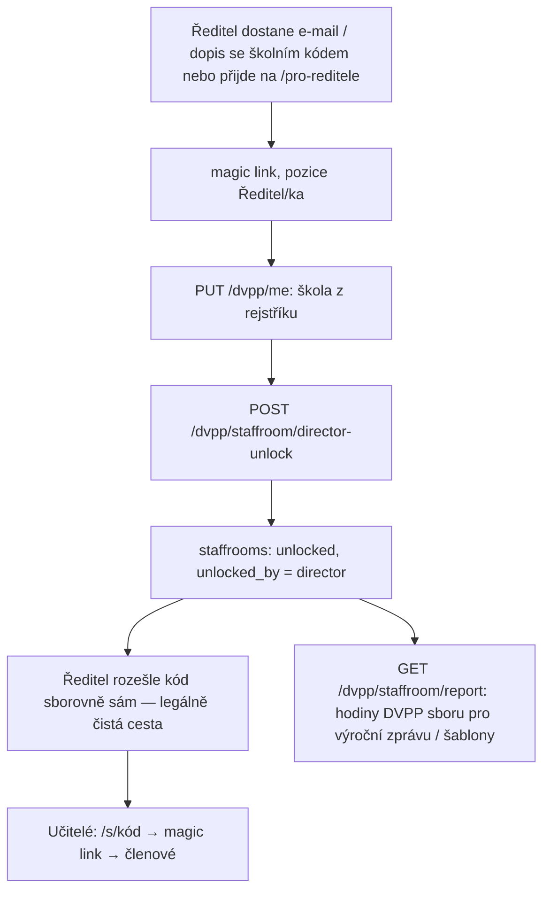
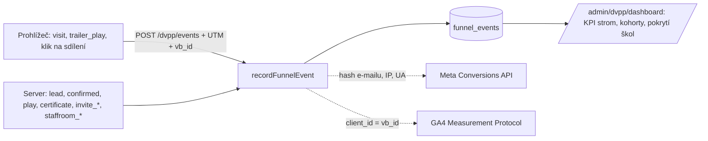

# Průběhy (flows) DVPP zdarma

## 1 · Přihlášení magic linkem a první vstup



## 2 · Sborovna: od prvního učitele k odemknutí



Pokles pod milník (odhlášení kolegy): cron `recountOne` → `grace` (30 dní), pak `expired`. Ředitelské, zákaznické a ruční odemknutí (`unlocked_by`) se nepřepočítává.

## 3 · Vzkaz kolegovi (režim WP29)



## 4 · Záznam, aktivace, certifikát

```mermaid
sequenceDiagram
  participant U as Učitel
  participant FE as Přehrávač /zaznam/{slug}
  participant E as Edge
  participant KV as KV (dotazník)
  participant DB as Postgres

  U->>FE: otevře záznam
  FE->>E: GET /dvpp/catalog → locked? (guest / starter limit)
  FE->>E: POST /dvpp/progress každých 30 s
  E->>DB: dvpp_progress; první zápis → funnel play; 180 s → activateMember
  U->>FE: „Získat osvědčení“ → existující DVPP dotazník (WebinarPostSurvey)
  FE->>E: POST /webinar-survey-submit (stávající) → KV webinar_survey_{id}_{md5}
  FE->>E: POST /dvpp/certificate { webinarId, title, hours, lecturer }
  E->>KV: existuje dokončený dotazník?
  E->>DB: certificates (number VB-DVPP-…), funnel certificate, activateMember
  FE->>FE: PDF z webinarCertificateDocument.ts (stejné číslo)
  U->>FE: police certifikátů v /knihovna (GET /dvpp/certificates)
```

## 5 · Ředitel a školní kód



## 6 · Měření: co se kam posílá



Dedup s browser pixelem: stejný `eventId` v `/dvpp/events` a ve `fbq('track', …, {}, { eventID })`.

## 7 · Cron a údržba

| Úloha | Kdy | Co dělá |
|---|---|---|
| `POST /cron/dvpp-recount` | denně 03:00 | přepočet sboroven (grace/expired), úklid vzkazů > 14 dnů, dopárování 300 kontaktů podle domény |
| `POST /admin/dvpp/schools/import` | po nahrání nového CSV rejstříku | upsert `schools` |
| `POST /admin/mailing/recompute-subject-interests` (existující) | týdně | zájmy o předměty → řádek „Doporučeno“ |

## 8 · Automatizace (spouštěče v `automation_flows`)

| Spouštěč | Kdy se má volat | Doporučená sekvence |
|---|---|---|
| `dvpp_confirmed` | po `verify` prvního přihlášení | D0 vítejte + první certifikát za 45 min · D2 nedokončený záznam · D5 pozvěte kolegu |
| `dvpp_certificate` | po vystavení | D0 PDF + „kolegům se bude hodit“ · D3 další díl řady |
| `dvpp_referral_confirmed` | kolega potvrdil | zakladateli „přibyl vám kolega, chybí N“ |
| `dvpp_staffroom_unlocked` | milník | celé sborovně „máte knihovnu zdarma“ |

Zapojení do `enrollInFlows` je další krok (viz CHANGELOG); typy jsou v `automationEngine.ts` už připravené.
