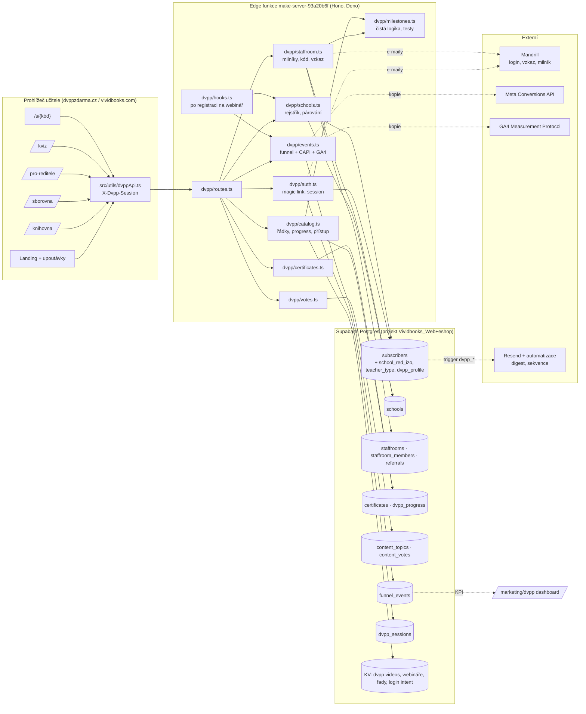

# DVPP zdarma · knihovna pro sborovny — technická dokumentace

Živá dokumentace projektu „DVPP zdarma jako lead magnet“ (strategie: [`../DVPP_LEAD_MAGNET_STRATEGIE.md`](../DVPP_LEAD_MAGNET_STRATEGIE.md)).
Aktualizuje se s každým krokem stavby; stav prací je v [`CHANGELOG.md`](CHANGELOG.md).

| Dokument | Co v něm je |
|---|---|
| [`DATOVY_MODEL.md`](DATOVY_MODEL.md) | ER diagram, tabulky, sloupce, stavy, indexy |
| [`API.md`](API.md) | všechny endpointy `/dvpp/*`, `/admin/dvpp/*`, `/cron/dvpp-*` s request/response |
| [`FLOWS.md`](FLOWS.md) | sekvence: přihlášení, sborovna, certifikát, měření, cron |
| [`CHANGELOG.md`](CHANGELOG.md) | co je hotové, co se staví, co čeká |

## Architektura na jednu obrazovku

## Zásady

1. **Obsah (záznamy) zůstává v KV**, nová data (školy, sborovny, certifikáty, události) jsou v Postgresu. Nic se nemigruje z Webflow.
2. **Zápis jen přes Edge funkci se service role.** Staff má SELECT přes `is_staff_email()`, anon nic. Učitel se identifikuje session tokenem (hlavička `X-Dvpp-Session`), ne Supabase auth.
3. **Žádný krok neblokuje registraci ani přehrání.** Párování školy, události, e-maily jsou v try/catch a logují se.
4. **Referral bez zadávání cizích e-mailů s pobídkou.** Učitel sdílí odkaz/kód sám; „vzkaz kolegovi“ je jednorázový, bez marketingu, adresa se maže po 14 dnech (WP29, zákon 480/2004 Sb.).
5. **Milník se počítá jen z potvrzených a aktivovaných** (přehrání ≥ 3 min nebo certifikát). Zakladatel a ředitel se počítají hned.
6. **`funnel_events` je jediný zdroj pravdy** pro KPI. Meta CAPI a GA4 dostávají kopii pro optimalizaci reklamy.
7. **Změna serveru = redeploy `make-server-93a20b6f`**, změna DB = migrace v `supabase/migrations/`. Frontend se nasazuje pushem do `main`.

## Nasazení (checklist)

- [ ] Migrace `20260905100000_dvpp_lead_magnet_core.sql` aplikovaná na produkci (`supabase db push`).
- [ ] Redeploy Edge funkce `make-server-93a20b6f`.
- [ ] `POST /admin/dvpp/schools/import` (naplní `schools` z CSV rejstříku v Storage).
- [ ] `POST /admin/dvpp/schools/backfill` opakovaně, dokud `linked > 0` (dopáruje 3 900 školních domén).
- [ ] pg_cron: migrace `20260905110000_schedule_dvpp_recount_cron.sql` (denně 03:15, secret z `app.mailing_cron_secret`).
- [ ] `POST /admin/mailing/flows/seed-defaults` → v `/mailing/automatizace` zapnout čtyři sekvence „DVPP · …“.
- [ ] Obsah: v `/marketing/dvpp` → Řady založit 4–5 řad, u 20 nejlepších záznamů doplnit délku, lektora, kapitoly a upoutávku.
- [ ] Digest: každé pondělí `/marketing/dvpp` → „Vygenerovat digest“ → v EmailBuilderu zkontrolovat, testovací odeslání, kampaň na aktivní odběratele.
- [ ] Velikost sborů: `POST /admin/dvpp/schools/import-sizes` s CSV ze statistiky MŠMT (jinak platí odhad z počtu žáků).
- [ ] Secrets (volitelné): `META_PIXEL_ID`, `META_CAPI_TOKEN`, `META_TEST_EVENT_CODE`, `GA4_MEASUREMENT_ID`, `GA4_API_SECRET`.
- [x] Frontend: routy `/knihovna`, `/knihovna/prihlaseni`, `/knihovna/zaznam/:id`, `/sborovna`, `/sborovna/letacek`, `/pro-reditele`, `/kviz`, `/s/:code`, admin `/marketing/dvpp` (nasazují se pushem do `main`).
- [ ] Obsah: u záznamů z Webflow (bez propojeného webináře v adminu) chybí `coverImageBgColor`; karta pak bere barvu z předmětu. Pro stejný vzhled jako na homepage doplnit obrázek a barvu u webináře v adminu (`/admin/webinare`).
- [ ] SEO prerender nových stránek v `scripts/seo-pages.mjs` (knihovna, pro-reditele).

## Jak se testuje

- Čistá logika (milníky, přístup, doména, kód, typ učitele): `npm test` → `scripts/run-unit-tests.ts`, sekce „dvpp“.
- Typy Edge modulů: `DENO_NO_PACKAGE_JSON=1 deno check --import-map=<jsr→npm mapa> src/supabase/functions/server/dvpp/routes.ts` (jsr.io je z CI proxy blokované, proto mapa na npm).
- Ruční průchod po deployi: `POST /dvpp/auth/magic-link` → e-mail → `GET /dvpp/auth/verify` → `GET /dvpp/catalog` s `X-Dvpp-Session`.
